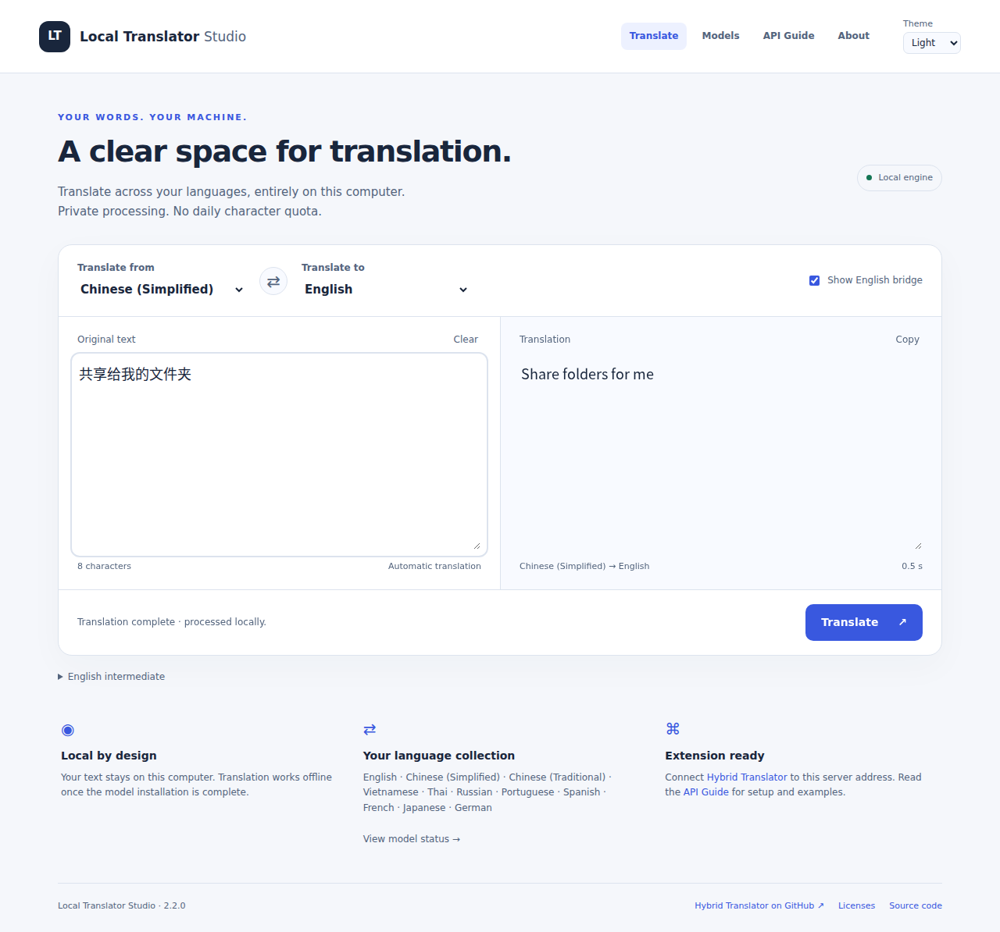
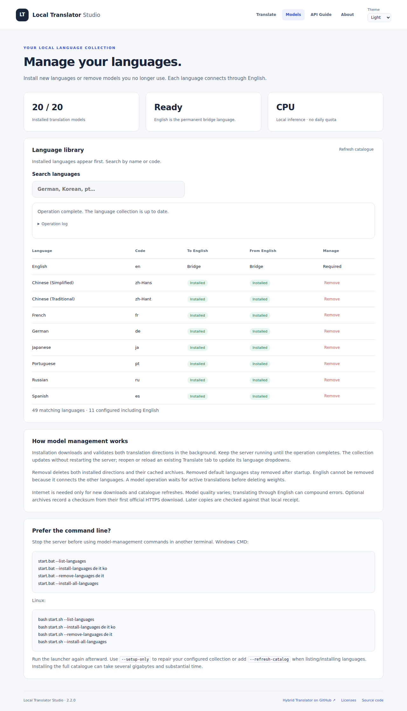
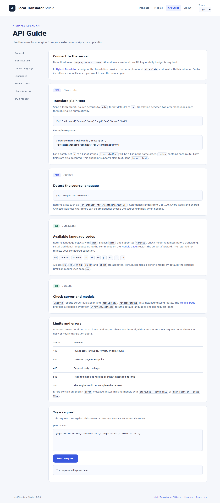
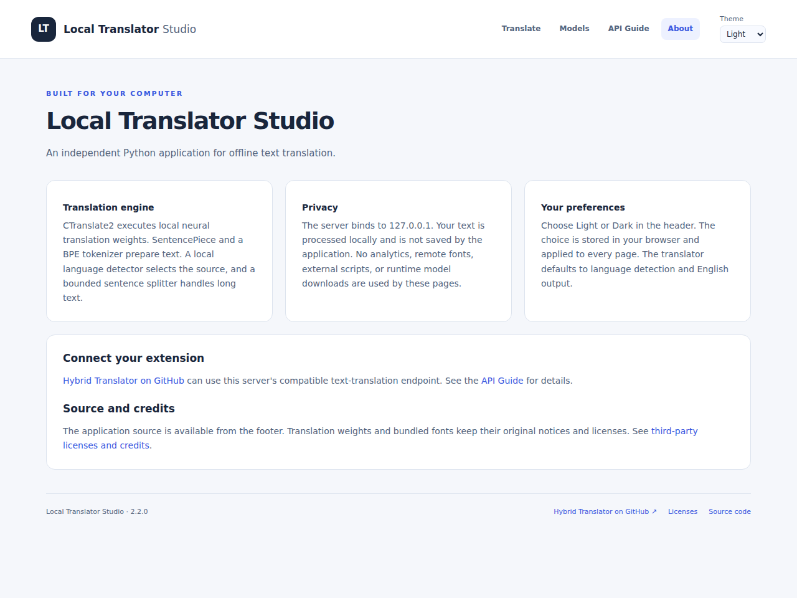
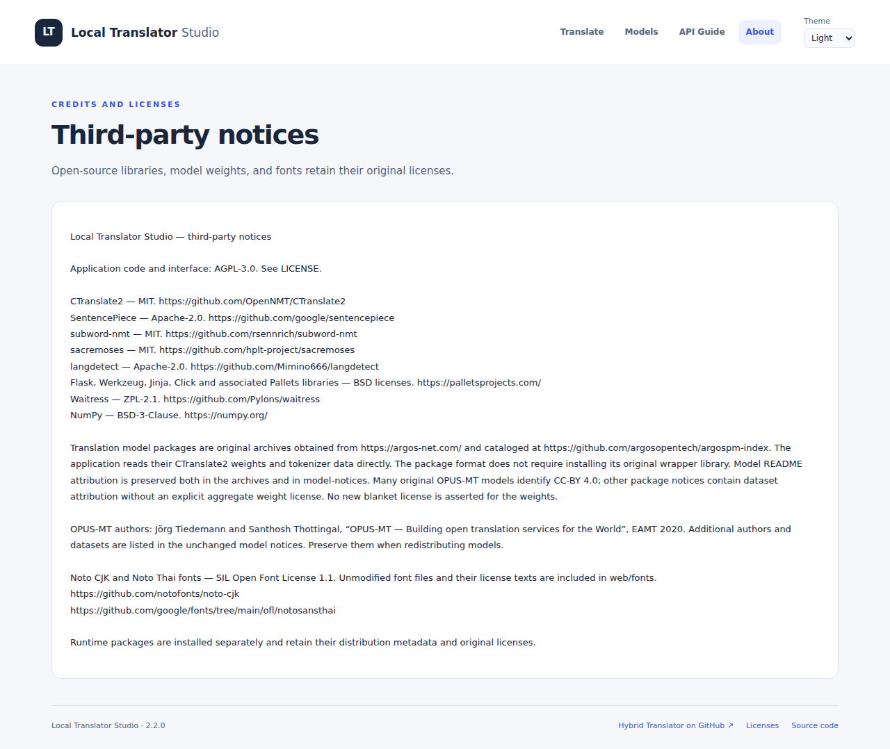
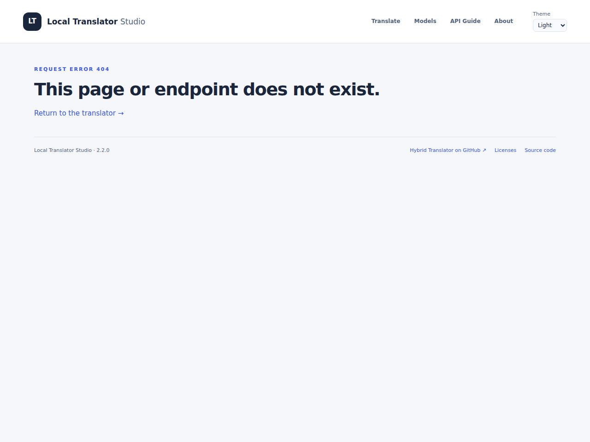
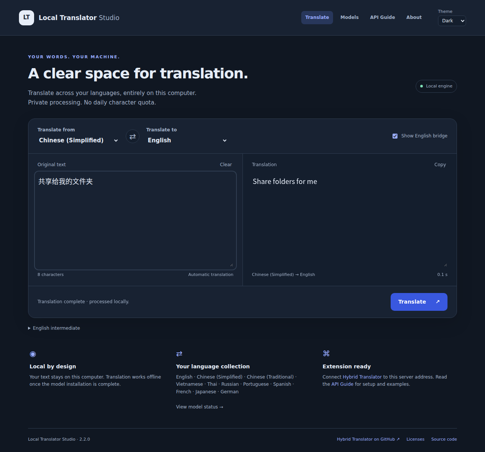

# Local Translator Studio

**Private text translation, running on your own computer.**

[Português (Brasil)](readme-ptbr.md) · [Quick start](#quick-start) · [Language management](#language-management) · [Screenshots](#screenshots) · [API](#local-api)

Local Translator Studio is a native Python application with a clean English web interface, automatic translation, light/dark themes and a local HTTP API. It runs CTranslate2 models directly on the CPU, with SentencePiece or BPE tokenizers. After installation, translation works offline.

**Version 2.2.0** · Python 3.10–3.12 x64 · Windows / Linux · AGPL-3.0



## Features

- Automatic translation after a 600 ms typing pause, including paste, language changes and IME composition.
- Detect language → English defaults, with configurable source and target languages.
- English as the bridge between two other languages; optional intermediate text display.
- Web language management: search, install, repair, remove, download progress and operation logs.
- Equivalent Windows CMD and Linux CLI commands for model management.
- Persistent light/dark themes and responsive English pages.
- Local processing, no API key and no daily translation quota.
- A compatible text endpoint for [Hybrid Translator](https://github.com/marcusbsilva/Hybrid-web-translator).

## Quick start

Install **64-bit Python 3.10, 3.11 or 3.12**. No Docker, GPU or PowerShell is required.

### Windows — CMD

Open CMD in the application directory and run:

```bat
start.bat
```

### Linux — terminal

Install Python and its matching `venv` package, then run from the application directory:

```sh
bash start.sh
```

Open **http://localhost:5000**. First startup creates an isolated `.venv`, installs dependencies and downloads missing models. Keep the terminal open; Ctrl+C stops the server. Internet is required for setup and new downloads, but installed translation routes work offline.

In the Tools release ZIP, the application directory is `Tools/LocalTranslator`. In a standalone GitHub checkout, it is the repository root.

If port 5000 is busy, use `start.bat --port 5001` or `bash start.sh --port 5001`, then open http://localhost:5001.

## Language management

### In the browser

Open **[Models](http://localhost:5000/models)**:

1. Search for a language by name or code.
2. Select **Install** to download and validate both directions, or **Repair** for a configured language with missing weights.
3. Follow the progress indicator, transferred bytes and operation log. Keep the server running until completion.
4. Select **Remove**, then confirm in the dialog to delete a language's two models and cached archives. Cancel leaves the collection untouched.

New languages become available to the server immediately after the job completes. Reopen or reload an existing Translate tab to refresh its language selectors. The Models page updates automatically without a server restart. Removed default languages remain removed on subsequent startup. **English is required** because it connects the other languages.

One model operation runs at a time. Removal waits for active translations before unloading weights. A failed optional pair remains disabled; other successful installations are preserved. Use **Refresh catalogue** to retrieve the latest official model list.

### Windows — CMD

Stop the server before managing models from another terminal. Run inside the application directory:

```bat
start.bat --list-languages
start.bat --install-languages de it ko
start.bat --remove-languages de it
start.bat --install-all-languages
start.bat --list-languages --refresh-catalog
start.bat --setup-only
start.bat
```

### Linux — terminal

```sh
bash start.sh --list-languages
bash start.sh --install-languages de it ko
bash start.sh --remove-languages de it
bash start.sh --install-all-languages
bash start.sh --list-languages --refresh-catalog
bash start.sh --setup-only
bash start.sh
```

`de it ko` adds German, Italian and Korean. Substitute any listed codes; use spaces to select several. Management commands exit when finished. `--setup-only` repairs the configured collection without starting the server; it does not reinstall intentionally removed languages. `--skip-install` starts an already configured runtime. The same options are available through `python run.py`.

Installing the entire catalogue can take several gigabytes and significant download time. Archive compatibility is validated during installation; not every optional route has been tested in this project. Repeat an interrupted operation to reuse completed downloads. Installation preserves other languages; removal also deletes the selected language's cached archives.

## Language coverage

The default installation provides **18 models / 10 languages including English**:

| Language | API code | Language | API code |
|---|---|---|---|
| English | `en` | Russian | `ru` |
| Chinese (Simplified) | `zh-Hans` | Portuguese | `pt` |
| Chinese (Traditional) | `zh-Hant` | Spanish | `es` |
| Vietnamese | `vi` | French | `fr` |
| Thai | `th` | Japanese | `ja` |

The bundled official catalogue snapshot, dated 2026-10-04, lists **49 non-English bidirectional pairs**. Only pairs with models both to and from English are offered. Choices include German, Italian, Korean, Arabic, Hindi, Ukrainian and a separate Brazilian Portuguese model (`pb`). Check the list command or Models page for the current catalogue.

Aliases `zh`, `zt`, `zh-CN`, `zh-TW`, `pt-BR` and `ptbr` remain compatible with the original models. `pt-BR` maps to generic `pt`; select optional `pb` explicitly for the Brazilian model. Automatic detection can be ambiguous for short text or scripts shared by languages; choose the source explicitly when needed.

Model quality varies. Passing through English may compound errors, and a successful model-load test does not establish translation accuracy.

## Screenshots

Real captures of the running application. All pages are English; both themes are included.

| Page | Purpose | Light | Dark |
|---|---|---|---|
| Translate | Automatic text translation | [View](docs/screenshots/translate-light.png) | [View](docs/screenshots/translate-dark.png) |
| Models | Install, repair and remove languages | [View](docs/screenshots/models-light.png) | [View](docs/screenshots/models-dark.png) |
| API Guide | Endpoint documentation and request tester | [View](docs/screenshots/api-guide-light.png) | [View](docs/screenshots/api-guide-dark.png) |
| About | Engine, privacy and integration | [View](docs/screenshots/about-light.png) | [View](docs/screenshots/about-dark.png) |
| Licenses | Third-party credits | [View](docs/screenshots/licenses-light.png) | [View](docs/screenshots/licenses-dark.png) |
| Error page | English error messages | [View](docs/screenshots/error-light.png) | [View](docs/screenshots/error-dark.png) |

<details>
<summary>Browse every page</summary>

### Models


### API Guide


### About


### Licenses


### Error page


### Dark translation workspace


</details>

## Local API

The server binds to `127.0.0.1`. No API key is needed for translation.

| Endpoint | Method | Purpose |
|---|---|---|
| `/translate` | POST | Translate one string or a JSON list |
| `/detect` | POST | Detect a configured source language |
| `/languages` | GET | Configured languages and targets |
| `/health` | GET | Server availability and model readiness |
| `/studio/status` | GET | Installed/missing models and limits |
| `/frontend/settings` | GET | Language defaults and request limits |

```python
import json
from urllib.request import Request, urlopen

request = Request(
    "http://localhost:5000/translate",
    data=json.dumps({"q": "Bonjour tout le monde", "source": "auto", "target": "en"}).encode(),
    headers={"Content-Type": "application/json"},
)
with urlopen(request) as response:
    print(json.load(response)["translatedText"])
```

Requests support plain text, up to 30 items and 64,000 characters total, with a maximum 1 MiB body. JSON lists return lists of translations; form fields also work. HTML/file translation is not implemented. Open `/docs` for examples and a local request tester.

For [Hybrid Translator](https://github.com/marcusbsilva/Hybrid-web-translator), configure a provider accepting a local `/translate` endpoint at `http://localhost:5000`. Enable fallback manually in the extension when you want to use it. This app does not modify extension dictionaries or settings.

The model-management endpoints are intended for the local Models page. Writes require its current page token and same-origin requests; they are not enabled through translation API CORS.

## Architecture and dependencies

| Layer | Implementation |
|---|---|
| Runtime and startup | Python, isolated venv, BAT / shell launchers |
| HTTP service | Flask and Waitress, localhost only |
| Neural translation | CTranslate2 on CPU; up to three cached models |
| Tokenization | SentencePiece, or BPE with subword-nmt and sacremoses |
| Language detection | langdetect with script hints |
| Interface | Jinja templates, local CSS and vanilla JavaScript |
| Model operations | Background worker, cross-process lock, atomic configuration writes |

Exact dependencies are pinned in `requirements.txt`. Bundled fonts and assets keep the interface independent of external CDNs. Translation text is processed locally and is not saved by the application. Explicit model-install/refresh operations use the internet.

Default downloads use bundled SHA-256 receipts. Optional archives without bundled hashes record the first official HTTPS download's hash for subsequent integrity checks; that local receipt is not independent publisher verification. Original weights/tokenizer notices are preserved. Catalogue source: [Argos model index](https://github.com/argosopentech/argospm-index).

## Upgrade and troubleshooting

For Studio 2.x, stop the server and replace application files, preserving `data` and `.venv`. For older applications, extract into a fresh directory and copy only the previous `data`; do not copy the old environment. The launcher rebuilds an obsolete runtime and reuses valid model archives.

| Issue | Action |
|---|---|
| Missing or broken models | Models → Repair, or run `--setup-only` |
| Download interrupted | Repeat the same installation operation |
| New language absent in Translate | Reload the Translate tab after completion |
| Another operation is running | Wait for the existing web/CLI job to finish |
| Windows DLL loading error | Check Python x64 and the Visual C++ 2015–2022 x64 runtime |
| Port already in use | Start with `--port 5001` |
| Management token expired after server restart | Reload Models |

Allow several GB of disk space for default archives, extracted weights and dependencies; more for additional languages. 8 GB RAM is a practical starting point, not a universal minimum. No GPU is required.

## Development and GitHub

For a standalone repository, commit the **contents of the application directory** so `README.md`, `server.py`, `.github` and `docs` are at the repository root. `.gitignore` excludes environments, models, caches and logs. Do not commit `data` or `.venv`.

```sh
python -m pip install -r requirements.txt
python -m unittest discover -s tests -v
python -m compileall -q engine.py server.py install_models.py language_registry.py model_manager.py
```

A GitHub Actions workflow runs management tests and syntax checks on Linux with Python 3.10 and 3.12. It does not download neural models. This workflow is supplied for your repository; it has not been executed on GitHub here. See [CONTRIBUTING.md](CONTRIBUTING.md), [CHANGELOG.md](CHANGELOG.md) and [VALIDATION.md](VALIDATION.md).

Actual VM checks include offline routes, web model installation/removal, automatic translation, both themes and responsive pages. Windows launcher review and dependency resolution are recorded separately; Windows runtime execution is not claimed.

## License and credits

Application source and interface: [AGPL-3.0](LICENSE). Model weights, dependencies and fonts retain their own licenses; see [THIRD-PARTY-NOTICES.md](THIRD-PARTY-NOTICES.md), `model-notices` and `web/fonts`. The footer offers a source ZIP excluding local models and environments.

Created for Marcus Silva's development portfolio. Related project: [Hybrid Translator](https://github.com/marcusbsilva/Hybrid-web-translator).
